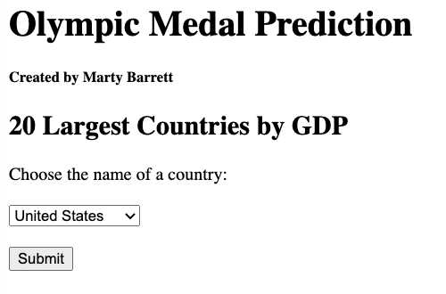
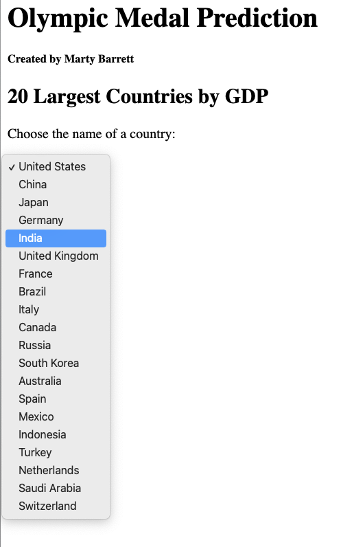
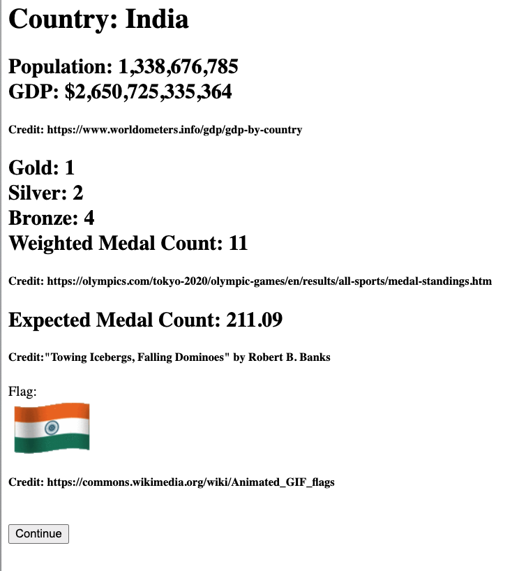
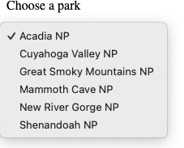
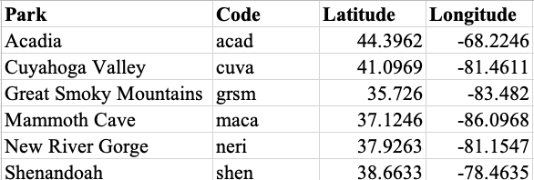

# 95-702 Distributed Systems
# Project 1
## Assigned: Friday, September 10, 2021
## Due: Friday, September 24, 2021, 11:59 PM

This project has five objectives:

**First**, you are introduced to IntelliJ and TomEE. You already have some practice
with these. In this assignment, you'll build several web apps to gain more
experience.

**Second**, you build your first set of distributed systems. These are two small
web applications using Servlets and Java Server Pages.

**Third**, you are introduced to web scraping.

**Fourth**, you are introduced to the MVC pattern if you have not used it before.

And **fifth**, as in all projects this semester, you should reflect on the
functional and non-functional characteristics (e.g. security, scalability,
failure handling, interoperability) of your solutions. There will be questions
on the final exam concerning these characteristics. You should be
able to demonstrate a nuanced comprehension of course content and be able to
explain the technical aspects in relation to potential real-world applications.
For each project task, software documentation is required. The software that you
write (Java files and so on) must contain comments that describe what each
significant piece of code is intended to accomplish. Points will be deducted if
code is not well documented. Read the documentation-related links provided on
the course schedule (for class #1) to understand what is expected.
Be sure to consult the rubric for details on grading.

# Deliverables
There are two parts to deliver, all zipped into one file for upload:
- a PDF containing relevant screeenshots of each part followed by code snippets (which is relative: how much to include is up to you for each part) that produced the result shown in the screenshot.
- your code, with each of the three tasks zipped together.
See the end for more detail, but read the project task descriptions first so that you know what the details are talking about.

# Task 1
# Use the IntelliJ Project Name:  Project1Task1

Create an index.jsp page that asks the user to enter a string of text data, and
to make a choice of two hash functions using radio buttons. The hash function
choices should be MD5 and SHA-256, with MD5 being the default.  When the submit
button is pressed a request is sent to a servlet. The servlet must be named
ComputeHashes.java. The servlet will compute the requested cryptographic hash
value (MD5 or SHA-256) from the text transmitted by the browser. You will need
to employ the Java crypto API to compute the hash of the text. The original text
will be echoed back to the browser along with the name of the hash, and the hash
value. The hash values sent back to the browser should be displayed in two
forms: as hexadecimal text and as base 64 notation. We will discuss the use of
such hash values later in the course.  To compute the MD5 and SHA-256 hashes,
use these standard java packages:

    import java.security.MessageDigest;
    import java.security.NoSuchAlgorithmException;

To print the Base64 encoding, use the following method:

    javax.xml.bind.DatatypeConverter.printBase64Binary

To print the hexadecimal encoding, use the following method:

    javax.xml.bind.DatatypeConverter.printHexBinary

Be sure to provide a simple and user friendly interface.  If you are unfamiliar
with HTML forms, a simple explanation can be found at:

    http://www.w3schools.com/html/html_forms.asp .

Be sure to create screen shots of your working application and submit them as
described in the Submission section at the end of this document.

# Task 2
## Use IntelliJ Project Name: Project1Task2
##	You can choose one of two alternative tasks, Task 2a or Task 2b

# Task 2a
Task 2a tests whether the Gross Domestic Product (GDP, the sum of all goods and services produced by a country) and its population can predict the number of Olympic medals that country wins. This is taken from the book *Towing Icebergs, Falling Dominoes, and Other Adventures in Applied Mathematics* by Robert B. Banks, Princeton University Press, 1998 (spoiler alert: towing icebergs from Antarctica for the water is not cost effective).

The prediction is based on a regression analysis of the 1992 Olympics. The model is

S = 0.1*(P*G^2)^(1/3)

where S is the weighted sum of the medals 3xgold + 2xsilver + 1xbronze, P is the population in millions (so divide by 1000000), G is the GDP in billions (divide by 1000000000), and ^ means pow(), so G is squared and then take the cube root of the product (use Math.pow( ) for that part).

Because GDP, population, and the overall number of medals offered may no longer fit that analysis, the model is not accurate - I've changed the constant from 0.215 to 0.1 to try to adjust, but that's just guessing.

In Task2a, you will use web scraping to get the GDP and population from the site

https://www.worldometers.info/gdp/gdp-by-country/

You'll scrape the medal counts from the Tokyo Olympics from the site

https://olympics.com/tokyo-2020/olympic-games/en/results/all-sports/medal-standings.htm

And finally you'll get a waving-flag gif from the site

https://commons.wikimedia.org/wiki/Animated_GIF_flags


## Input
Only the top 20 countries by GDP will be used. Figure 1 show the initial input screen.  The country will be chosen from a drop-down box of country names. Be sure to include your name (not mine) as the author.  Figure 2 shows the country drop-down box.


***Figure 1***

---


***Figure 2***

## Output
Figure 3 shows the output screen, where the user has chosen Australia. It contains the country's name, the population and GDP (with the credit line for worldometers); the number of gold, silver, and bronze medals won (with the credit line for the Olympics site); the weighted sum of the medals (3xgold + 2xsilver + 1xbronze); the estimate of that weighted sum - the expected medal count (with the credit line for the book); and finally the waving-flag gif (with the credit line for the flag site). The flag is an animated gif.


***Figure 3***

When the user presses the "Continue" button, return to the original screen.

The three sites have some differences in the way they reference the countries. The worldometers site uses "South Korea", "United Kingdom", "United States", and "Saudi Arabia", but the flag site uses "South-Korea", "United-Kindgom", "South-Korea", and "Saudi-Arabia". In addition, there are several territories associated with the United States and the United Kingdom that have flags, so you'll see those names repeated. The Olympics site uses "ROC" for Russia, "Great Britain" for the United Kingdom, and "Republic of Korea" for South Korea. In other words, you may have to make adjustments for these variations.

## Screen Scraping
Screen scraping is programmatically processing the HTML that typically is
displayed by a browser and can be a useful tool when your data source does not
have an API that provides structured data. Instead, you can search or parse the
HTML to find and extract the data that you need. For more information, see

> https://en.wikipedia.org/wiki/Web_scraping

Your application should work similarly to InterestingPicture, but instead of
searching Flickr, it will use the sites mentioned above.

## Notes and hints
- Refer to http://www.w3schools.com for good help on the basic HTML you need for this task. This has examples of drop-down boxes and radio buttons.

- You are allowed to and encouraged to build your solution based on the
  InterestingPicture code you have been given in class. You MUST refactor it,
  however, to have project, variable, and class names that make sense for your
  application. For example, <b>you will lose points</b> if your class is still named
  InterestingPictureServlet.

- You do not need to, but you are welcome to, use jsoup (https://jsoup.org/)
  which is a Java HTML Parser, to do the flag scraping.  The downsides of using
  jsoup are you will first need to understand the Document Object Model (DOM)
  and CSS Selectors. These are both useful to know.  o The upside of using jsoup
  is that it makes it much easier to find and select content from HTML (i.e.
  screen scrape).

SSLHandshakeException
Some sites require you to make https, not http requests. When you do so from
your Java program, you will hit an SSLHandshakeException. We will be covering
SSL and related topics in a few weeks. In the meantime, you will have to deal
with this exception.  

If you use jsoup, you should use validateTLSCertificates(false). (Refer to the
jsoup API to understand this when you need it.)

If you do not use jsoup, here is a code to replace the fetch method in
InterestingPictureModel to ignore the exception. The parameter "certType" should be set to the string "TLSV1.3".

```
private String fetch(String searchURL, String certType) {
    try {
        // Create trust manager, which lets you ignore SSLHandshakeExceptions
        createTrustManager(certType);
    } catch (KeyManagementException ex) {
        System.out.println("Shouldn't come here: ");
        ex.printStackTrace();
    } catch (NoSuchAlgorithmException ex) {
        System.out.println("Shouldn't come here: ");
        ex.printStackTrace();
    }

    String response = "";
    try {
        URL url = new URL(searchURL);
        HttpURLConnection connection = (HttpURLConnection) url.openConnection();

        // Read all the text returned by the server
        BufferedReader in = new BufferedReader(new InputStreamReader(connection.getInputStream(), "UTF-8"));
        String str;
        // Read each line of "in" until done, adding each to "response"
        while ((str = in.readLine()) != null) {
            // str is one line of text readLine() strips newline characters
            response += str;
        }
        in.close();
    } catch (IOException e) {
        System.err.println("Something wrong with URL");
        return null;
    }
    return response;
}

private void createTrustManager(String certType) throws KeyManagementException, NoSuchAlgorithmException{
    /**
     * Annoying SSLHandShakeException. After trying several methods, finally this
     * seemed to work.
     * Taken from: http://www.nakov.com/blog/2009/07/16/disable-certificate-validation-in-java-ssl-connections/
     */
    // Create a trust manager that does not validate certificate chains
    TrustManager[] trustAllCerts = new TrustManager[] {new X509TrustManager() {
        public X509Certificate[] getAcceptedIssuers() {
            return null;
        }
        public void checkClientTrusted(X509Certificate[] certs, String authType) {
        }
        public void checkServerTrusted(X509Certificate[] certs, String authType) {
        }
    }
    };

    // Install the all-trusting trust manager
    SSLContext sc = SSLContext.getInstance(certType);
    sc.init(null, trustAllCerts, new java.security.SecureRandom());
    HttpsURLConnection.setDefaultSSLSocketFactory(sc.getSocketFactory());

    // Create all-trusting host name verifier
    HostnameVerifier allHostsValid = new HostnameVerifier() {
        public boolean verify(String hostname, SSLSession session) {
            return true;
        }
    };

    // Install the all-trusting host verifier
    HttpsURLConnection.setDefaultHostnameVerifier(allHostsValid);
}

```

Track Piazza for additional hints and answers to questions.

## Deliverables

In addition to your project code, produce screen shots showing two different
countries and years.

# Alternative Task 2b

You may choose to develop your own web app idea that uses screen scraping.  Your
application should do the following:

1.	Have a welcome page that gives the user
directions.  The welcome page should include text field(s) or selection menu(s)
and a submit button.

2.	Based on the input from the user, your web app should screen scrape some web
site and: a.	Extract some information from it,
b.	Manipulate, combine, analyze, sum, or in some way do something with the extracted information,
c.	Return the results of this to the user for display.

3.	Allow the user to change their input and submit again from the results page.

4.	Handle failure gracefully For example, you might screen scrape cricket
information from cricruns.com and allow the user to select a country and range
of years and return the combined win/loss record over those years.
You should check the Terms of Use of any site you intend to use to make sure
that the site does not explicitly disallow screen scraping.  For example, the
official NHL web site disallows any use to "Engage in unauthorized spidering,
scraping, or harvesting of content or information, or use any other unauthorized
automated means to compile information"
(https://www.nhl.com/info/terms-of-service) It is acceptable to use a site that
has an API, but you are not allowed to use the API to return structured data.
For this assignment you must fetch HTML and process it (i.e. screen scrape).
Because your web app will work differently than the default one, it is in your
best interest to explain to the grading TA exactly how it works.  Therefore,
create a document that includes:
1.	Screen shots of your working web application
2.	Screen shot of your web application gracefully failing (to test, turn off
your wifi so that the HTTP request to source of your data fails).
3.	A description of how the web application meets requirements 1-4 above.

Alternatively you can create a screencast video of your working web app.
- The video cannot be more than 3 minutes long
- An audio voiceover should explain what your application does and how it meets requirements 1-4 above.
- You should publish the video as 'Unlisted' to YouTube.  (See more discussion
  on this in the Submission section below.)
- Include the URL of the YouTube video in a document in the Project1Task2
  Description folder that you submit.

# Task 3 – Use the IntelliJ Project Name: Project1Task3

Implement a web application that implements a simple desktop and mobile
“clicker” for class.  Your app should allow users to submit answers to questions
posed in class, and should provide a separate URL end point for getting the
results of the submitted responses.  The welcome page for your app should be
similar to Figure 4.  You can make it more stylish if you like,
but it is not required.


***Figure 4***

When the user makes a choice and hits “submit”, their answer should be stored in
your MVC model.  The response should be similar to the picture on the left.
Notice that it is **required** to provide feedback to the user regarding the choice
that they made (i.e. “D” in this example).

The user should also have the ability to submit another answer as shown in the
screenshot.


***Figure 5***

You can test the application by repeatedly submitting answers and allowing your
model to tally the results.  Your web app should also have a URL path
“/getResults” (shown in Figure 6) for listing the results of user voting.


***Figure 6***

## Requirements for the /getResults path:

1. List each answer that has been given, and the number of times a user has submitted that answer.
2. You do not have to list options that have been chosen zero times.
3. The results should be displayed sorted in alphabetical order.
4. /getResults should also clear the stored results so that a new question can be posed.
5. If there are no results available, then report this as shown in Figure 7.


***Figure 7***

Note that requirement 4 does not adhere to the HTTP standard for a GET request.
You should understand why this is bad behavior according to the standard, and
how you could fix it (It might be on the exam).

The web app should work with a mobile browser.  For this project you can use a simple
check like the one that was used in InterestingPicture and then use an appropriate mobile doctype.
An easy way to check your web app for mobile is to use the Google Chrome DevTools
Using the Google Chrome browser.
- Browse to your web application in Chrome
- Access the Chrome DevTools
(https://developers.google.com/web/tools/chrome-devtools/?hl=en#access-devtools).  
- Toggle device mode to mobile and choose an Android or iPhone device
(https://developers.google.com/web/tools/chrome-devtools/iterate/device-mode/?hl=en)
- Reload the page.
- In addition to testing, you use this to produce a screen shot showing your web
  app working for mobile.  If your page looks like the one on the right, even
  after reloading, then the doctype is not being set correctly.   

Figure 9 is what the web app should look like for mobile if the
doctype is set correctly.


***Figure 9***

## Overall web app requirements:
- You must use MVC to separate concerns.
- Use appropriate HTTP methods (i.e. not just GET)
- Implement only one HttpServlet

## Hints:
- You can have multiple URL patterns in a WebServlet annotation.  For example,
  you can indicate that a servlet can be called by two paths such as:
  urlPatterns = {"/submit", "/getResults"}
- In order to determine within the servlet which path was actually requested,
  you can use request.getServletPath();

Produce screen shots of your application:
- With the answer options on desktop
- With the getResults on desktop
- With the answer options on mobile
- With the getResults on mobile

## Questions:
If you have questions, you can post them to the class Piazza and tag them as “Project1”.

# Summary & Submission:
Be sure to review the Rubric linked on the course schedule for the first day.

Submit a PDF containing the following:

### Task 1:
1. Screen shots of input, MD5 and SHA-256 output, both in hex and base 64
2. Code snippet of computation of each hash

### Task 2a:
1. Screen shot of input page, drop-down menu, output page for United States and Great Britain.
2. Code snippets for:
- scraping of population and gdp
- scraping of medals
- scraping of flag

### Task 2b:
Screen shots and code snippets are up to you.

### Task 3:
1. Screen shots of input page, output page (one vote), results page
2. Code snippet from the Java code that produces the output page and the results page.

**Video sharing rights:** If you are creating screencast videos for 2b, then you should set
the YouTube sharing rights 'Unlisted' when publishing to YouTube. There are
three types of sharing rights on YouTube: Public, Private and Unlisted. You do
not want other students to be able to see your video (that would be cheating),
and ‘Unlisted’ restricts viewing to only those who have your URL.

Fore each project, use FileExplorer or Finder, navigate to your project directory, and zip ***only*** the .java and .jsp files together. The zip those together with the PDF file of screenshots and code snippets.

**You must export in this way and NOT just zip the IntelliJ project folders.**
